<b>□タイタニック号沈没の際の生存者を予想します□</b>

Kaggleコンペ 
https://www.kaggle.com/competitions/titanic 
で、タイタニック号沈没の際の生存者を予想します。 

<b>□データ解析について□</b> 
今回は決定木モデルを使用したベースラインの作成について記述しています。 
今後の課題として、LightGBMモデルを用いたパラメータ設定ができるようにしたいと思っています。 
また、検証方法はホールドアウト検証としましたが、クロスバリデーションも取り入れていきます。 

<b>□環境□</b> 
【言語】Python 
【OS】Windows 
Google Colaboratory上でPython実行。 
GitHubのローカルリポジトリは、Visual Studio Codeで編集。 

<b>□背景□</b> 
1912年4月15日、豪華客船タイタニック号が氷山とぶつかって沈没しました。 
乗客約2,000名のうち、2/3に及ぶ乗客が死亡した沈没事故です。 
すでに生死がわかっている学習用データを用いて、生死の不明な乗客リストの生死を予想します。 

乗客はそれぞれ以下のような属性を持っています。（一部欠損あり） 
PassengerId 乗客のID(ユニーク) 
Survived ⽣存フラグ（0=死亡、1=⽣存） 
Pclass チケットのクラス（1が最も良いクラス） 
Name 乗客の名前 
Sex 性別（male=男性、female＝⼥性） 
Age 乗客の年齢 
SibSp 同乗している兄弟/配偶者の数 
Parch 同乗している親/⼦供の数 
Ticket チケット番号 
Fare 料⾦ 
Cabin 客室番号 
Embarked タイタニック号に乗った港 

<b>□Titanicデータの構成□</b> 
gener_submission.csv : 乗客のIDと生死のリスト 
test.csv : 生死の不明な乗客リスト 
train.csv : 生死のわかっている乗客リスト 

<CODE>
# 0.Titanicデータのマウント
from google.colab import drive
drive.mount('/content/drive')
 
# 1.データ理解・可視化
# 1.1 ライブラリのインポート
import numpy as np
import pandas as pd
import matplotlib.pyplot as plt
import seaborn as sns
%matplotlib inline
 
# Numpy:行列計算や数値を扱う用のモジュール
# Pandas:表形式のデータを扱う用のモジュール
# Matplotlib:グラフ描画用モジュール
# Seaborn:Matplotlibよりもきれいなグラフを描画するためのモジュール
 
# 1.2 データの読み込み
# PATHの設定
dir_path = '/content/drive/MyDrive/datascience-for-beginner/titanic/'
# 学習データの読み込み
train_df = pd.read_csv(dir_path + 'train.csv')
# テストデータの読み込み
test_df = pd.read_csv(dir_path + 'test.csv')
 
# 1.3 欠損値の確認
# データ内の⽋損値を確認する。
train_df.isnull().sum()
 
# 結果
PassengerId      0
Survived         0
Pclass           0
Name             0
Sex              0
Age            177
SibSp            0
Parch            0
Ticket           0
Fare             0
Cabin          687
Embarked         2
dtype: int64
 
# 学習用データtrain_dfでは、Age,Cabin,Embakredに欠損が認められる。
# 同様にテスト用データtest_dfでも、データ内の⽋損値を確認する。
test_df.isnull().sum()
 
# 結果
PassengerId      0
Pclass           0
Name             0
Sex              0
Age             86
SibSp            0
Parch            0
Ticket           0
Fare             1
Cabin          327
Embarked         0
dtype: int64
 
# テスト用データtest_dfでは、Age,Cabinの他、Fareでも欠損が認められる。Embarkedでの欠損は無し。
 
# 1.4 データの理解
# 今回はKaggleコンペなので、学習用データとテストデータが分かれているが、実際の現場ではデータに区別はないため、2つのデータを結合する。
# 学習データとテストデータを連結する。
df = pd.concat([train_df, test_df], ignore_index=True)
# 結合がうまくできているか確認する。
# 連結したデータの⼤きさを確認する。
df.shape
 
# 結果
(1309, 12)
 
# 学習用データが891行、テスト用データが418行だったので結合に成功していると言える。(891+418=1309)
# テスト用データにはSurvivdedのカラムがないので、欠損しているはずである。本当に欠けているか確認する。
# 最後の5⾏を確認。
df.tail()
 
# 結果

 
# Survivedの中身が欠損していることが確認できた。
 
#1.5 データの可視化①Matplotlib
# ①性別ごとにグループ分けして、②各性別ごとにカウントする。
df.groupby('Sex')["PassengerId"].count()
tmp = df.groupby('Sex')["PassengerId"].count()
# グラフの⼤きさを設定
plt.figure(figsize=(6, 4))
# 性別の数を確認してみる。
plt.bar(tmp.index, tmp.values)
plt.show()
 
# 結果
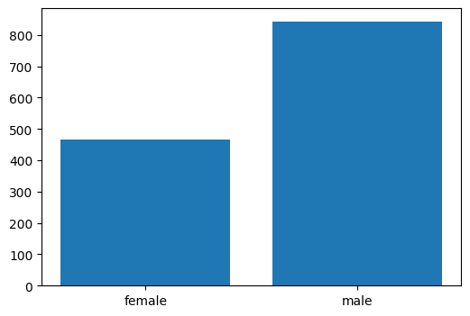
 
# データの可視化②Pandas
# pandasで棒グラフを作成する。
tmp.plot(kind='bar', figsize=(6, 4))
 
# 結果
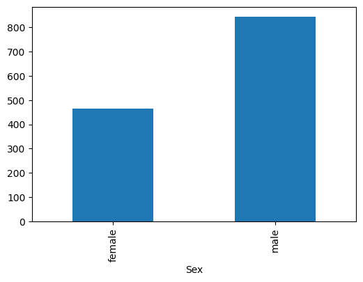
 
# データの可視化③Seaborn
# グラフの⼤きさを設定。
plt.figure(figsize=(6, 4))
# 性別の数を確認してみる。
sns.countplot(data=df, x="Sex")
plt.show()
 
# 結果
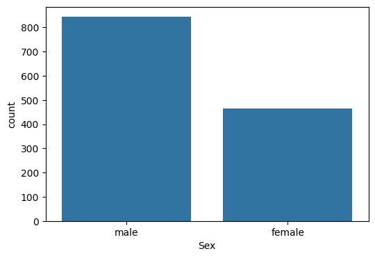
 
#Survivedカラムの内訳を表示する。
# グラフの⼤きさを設定。
plt.figure(figsize=(6, 4))
# 性別の数を確認してみる。
sns.countplot(data=train_df, x="Survived")
plt.show()
 
#結果
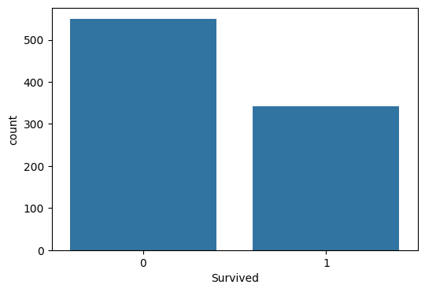
# Survivedカラムは0:死亡 1:生存なので、生存者の方が少ないことがわかる。
 
#1.6 データの加工・前処理
# 今回は簡便化のため、以下4つの属性を特徴量として用いる。
# ・ チケットのクラス
# ・ 年齢
# ・ 性別
# ・ 出発した港
 
# 今回使⽤しないカラムを削除する。
df2 = df.drop(columns=['Cabin', 'Fare', 'Ticket', 'SibSp','Parch', 'Name'])
#　カラムを表示して整理できているか確認する。
# df2を表⽰する。
df2.head()
 
# 結果
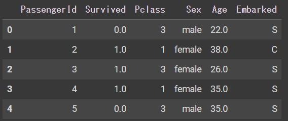
 
# 2.1 欠損値の補充
# データ内の⽋損値を確認する。
df2.isnull().sum()
 
# 結果
PassengerId      0
Survived       418
Pclass           0
Sex              0
Age            263
Embarked         2
dtype: int64
 
# Embarkedの欠損値を補完する。
# 今回は最も乗客の多い港（タイタニック号に乗船した港）で欠損値を補完する。
# グラフの⼤きさを設定。
plt.figure(figsize=(6, 4))
# 出発した港の数を確認してみる。
sns.countplot(data=df2, x="Embarked")
plt.show()
 
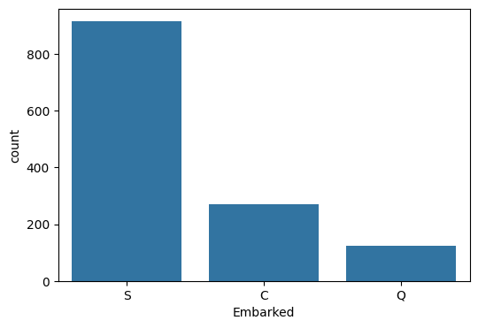
 
# ほとんどがS港から乗船していることがわからるので、欠損値をSで補完する。
# データに変更を加える際に、安全に変更を加えていきたいので、データをコピーして進める。
# 元データをコピー。
df3 = df2.copy()
# ⽋損値の補完
df3["Embarked"] = df3["Embarked"].fillna('S')
# Embarkedの⽋損値を再度確認する。
print('⽋損値の数︓', df3["Embarked"].isnull().sum())
 
# 結果
⽋損値の数︓ 0
 
# Ageの欠損値を補完する。
# Ageの⽋損値を確認する。
print('⽋損値の数︓', df3["Age"].isnull().sum())
 
# 結果
⽋損値の数︓ 263
 
# 乗客の年齢のうち、最も多い年代で欠損値を補完する。
# 年齢の最⼩値と最⼤値を確認。
print('最⼩値:', df3["Age"].min())
print('最⼤値:', df3["Age"].max())
 
# 結果
最⼩値: 0.17
最⼤値: 80.0
 
# ヒストグラムを8つのビンに分割して作成する。
# グラフの⼤きさを設定。
plt.figure(figsize=(6, 4))
# ヒストグラムを作成する。
sns.histplot(df3["Age"], kde=False, bins=8)
plt.show()
 
# 結果
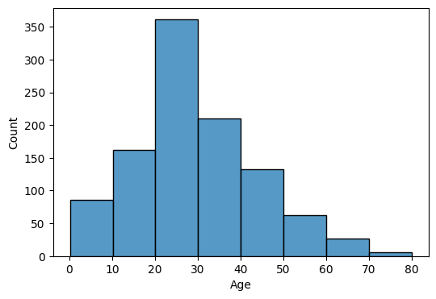
 
# 20～30代が最も多いことがわかる。
# 年齢の中央値で補完する。
# df3をコピー
df4 = df3.copy()
# 年齢の中央値を計算。
age_median = df4["Age"].median()
# 年齢の⽋損値を中央値で補完する。
df4["Age"] = df4["Age"].fillna(age_median)
# 年齢の⽋損値の数を確認する。
print('⽋損値の数︓', df4["Age"].isnull().sum())
 
# 結果
⽋損値の数︓ 0
 
# 2.2 カテゴリ変数の数値変換
# 2.2.1 乗船した港の数値変換
# ワンホットエンコーディング「該当する部分には1, そうではない部分には0」を使用する。
# 乗船した港（Embarked）をワンホットエンコーディングしてみる。
pd.get_dummies(df4['Embarked'])
 
# 結果
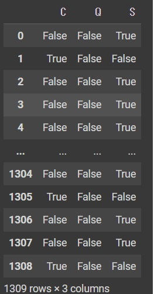
 
# 変数ohe_embarkedにEmbarkedの変換結果を⼊れる。
ohe_embarked = pd.get_dummies(df4['Embarked'], prefix="Embarked")
ohe_embarked.head()
 
# 結果
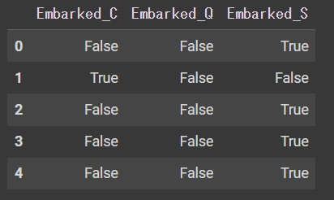
 
# ワンホットエンコーディングの結果を元のデータフレームに連結する。
df5 = pd.concat([df4, ohe_embarked], axis=1)
df5.head()
 
# 結果
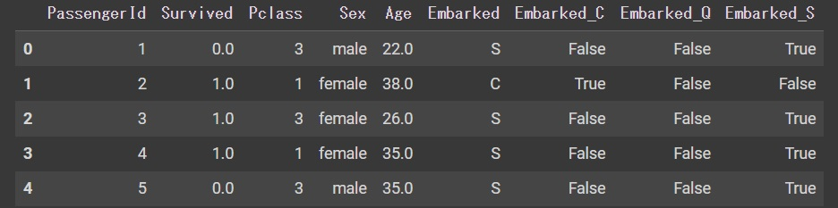
 
# カテゴリ変数が格納されている元のカラム"Embarked"を削除する。
# Embarkedを削除する。
df6 = df5.drop(columns=["Embarked"])
df6.head()
 
# 結果
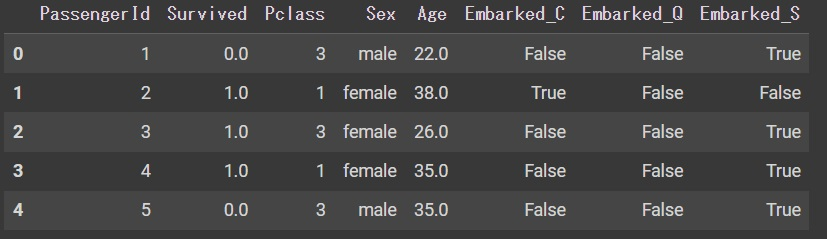
 
# 2.2.2 性別の数値変換
# 性別は男女2つしかないので、ラベルエンコーディングを用いる。
# ラベルエンコーディングした結果を反映する。
df6['Sex'] = pd.get_dummies(df6["Sex"], drop_first=True)
# データフレームの先頭5⾏を確認する。
df6.head()
 
# 結果
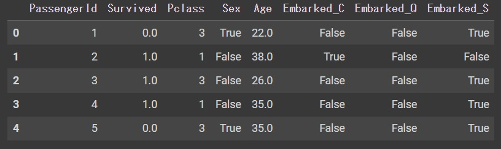
 
# 3.データセットの作成
# 学習データとテストデータの分割をする。Sruvivedカラムが空だったらテストデータ。
# Survivedが空ではないデータをtrain_dfに格納する。
train = df6[~df6["Survived"].isnull()]
# Survivedが空のデータをtest_dfに格納する。
test = df6[df6["Survived"].isnull()]
# trainの中⾝を確認する。
train.head()
 
# 結果
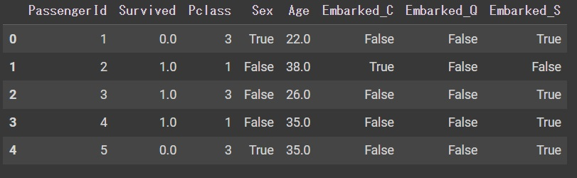
 
# trainの中⾝を確認する。
train.tail()
 
# 結果
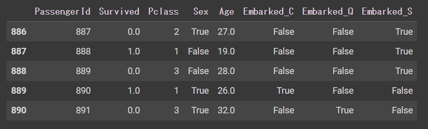
 
# testの中⾝を確認する。
test.head()
 
# 結果
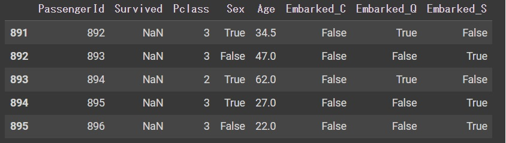
 
# 学習データとテストデータが分割できた。
# testからSurvivedカラムを削除。
test = test.drop(columns=['Survived'])
test.head()
 
# 結果
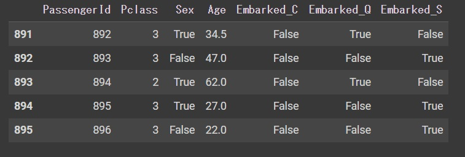
 
# 説明変数と目的変数に分ける。
# ⽬的変数をy_trainに格納する。
y_train = train["Survived"]
# 説明変数をX_trainに格納する。
X_train = train.drop(columns=['Survived', "PassengerId"])
print("元のdf", train.shape)
print("説明変数", X_train.shape)
print("⽬的変数", y_train.shape)
 
# 結果
元のdf (891, 8)
説明変数 (891, 6)
⽬的変数 (891,)
 
# 説明変数を確認
X_train.head()
 
# 結果

 
# ⽬的変数を確認
y_train.head()
 
# 結果
0    0.0
1    1.0
2    1.0
3    1.0
4    0.0
Name: Survived, dtype: float64
 
# 4.モデルの作成
# 今回は決定木モデルを使う。
# 決定⽊のインポート
from sklearn.tree import DecisionTreeClassifier
# 乱数を42で固定する。
# 決定⽊モデルの準備。
model = DecisionTreeClassifier(random_state=42)
# 決定⽊モデルの作成。
model.fit(X_train, y_train)
 
# 5.モデルの評価
# 今回はホールドアウト検証を用いる。
# train_test_splitをimportする。
from sklearn.model_selection import train_test_split
# 学習⽤と評価⽤のデータに分割する。
x_tr, x_va, y_tr, y_va = train_test_split(
X_train, y_train, test_size=0.2, random_state=42
)
print("学習⽤: ", x_tr.shape, y_tr.shape)
print("評価⽤:", x_va.shape, y_va.shape)
 
# 結果
学習⽤:  (712, 6) (712,)
評価⽤: (179, 6) (179,)
 
# 8:2の割合で分割できていることが確認できた。
# 目的変数の内訳を確認する。
y_tr.value_counts()
 
# 結果
Survived
0.0    444
1.0    268
Name: count, dtype: int64
 
y_va.value_counts()
 
# 結果
Survived
0.0    105
1.0     74
Name: count, dtype: int64
 
# 学習用は0の割合が62.4%、評価用は、58.7%
# 目的変数の割合を統一するために層化する。
# 学習⽤と評価⽤のデータに分割する（層化付き）
x_tr, x_va, y_tr, y_va = train_test_split(
X_train,
y_train,
test_size=0.2,
stratify=y_train,
random_state=42
)
# ラベルの件数を確認する。
y_tr.value_counts()
 
# 結果
Survived
0.0    439
1.0    273
Name: count, dtype: int64
 
# ラベルの件数を確認する。
y_va.value_counts()
 
# 結果
Survived
0.0    110
1.0     69
Name: count, dtype: int64
 
# 学習用、評価用双方とも0の割合が61.4%となった。
# モデルを再度作成。
model.fit(x_tr, y_tr)
# 学習⽤データを使ってモデルの予測値を計算する。
y_tr_pred = model.predict(x_tr)
# 評価⽤データを使ってモデルの予測値を計算する。
y_va_pred = model.predict(x_va)
# データ全体でどのくらいの精度になっているか確認する。
from sklearn.metrics import accuracy_score
# 学習⽤データの正解率を計算する。
accuracy_tr = accuracy_score(y_tr, y_tr_pred)
# 評価⽤データの正解率を計算する。
accuracy_va = accuracy_score(y_va, y_va_pred)
print("学習⽤: ", accuracy_tr)
print("評価⽤: ", accuracy_va)
 
# 結果
print("学習⽤: ", accuracy_tr)
print("評価⽤: ", accuracy_va)
 
# 6.テストデータの予測
# testの中⾝を確認する。
test.head()
 
# 結果

 
# モデル作成にPassenger Idは不要なので、削除して予測値を出す。
# 変数testからPassengerIdを削除する。
x_test = test.drop(columns=["PassengerId"])
# x_testを使ってモデルの予測値を計算する。
y_test_pred = model.predict(x_test)
# y_test_predの先頭5つを確認する。
y_test_pred[:5]
 
# 結果
array([0., 0., 0., 0., 1.])
 
# 予測結果をテストデータに反映する。
test['Survived'] = y_test_pred
# テストデータの先頭5⾏を確認する。
test.head()
 
# 結果
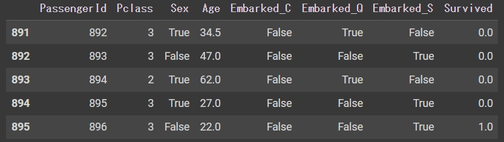
 
# モデルの予測結果、Survivedが反映された。
 
# 7.Kaggle提出用データの作成
# 提出⽤のデータフレームを作成する
submit_df = test[['PassengerId', 'Survived']].set_index('PassengerId')
# 先頭5⾏を確認する。
submit_df.head()
 
# 結果
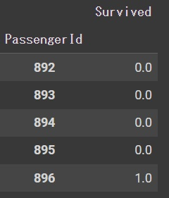
 
# Survivedが小数表記になっているので、整数に変換する。
# 予測結果を整数に変換する。
submit_df["Survived"] = submit_df["Survived"].astype(int)
submit_df.head()
 
# 結果
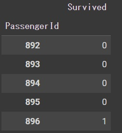
 
# CSVの作成
submit_df.to_csv("submission.csv")
 
# 8.ベースラインでの最終結果
# Kaggleにファイルを提出すると、約76.3%の正解率でした。
</CODE>
 

<b>課題</b> 
今回は、IDと生存フラグを除く10属性のうち、2属性で評価しましたが、残り8属性についても追加して確認したいです。 
評価モデルは、簡易的な決定木モデルとしましたが、LightGBMモデルを用いて、パラメータ設定ができるようにしたいと思っています。 
また、検証方法はホールドアウト検証としましたが、クロスバリデーションも取り入れてきたいと考えています。 
